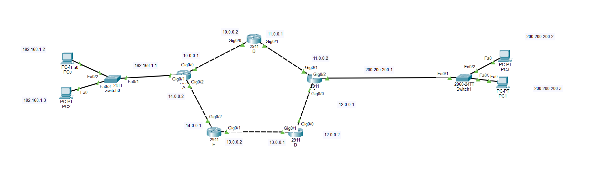
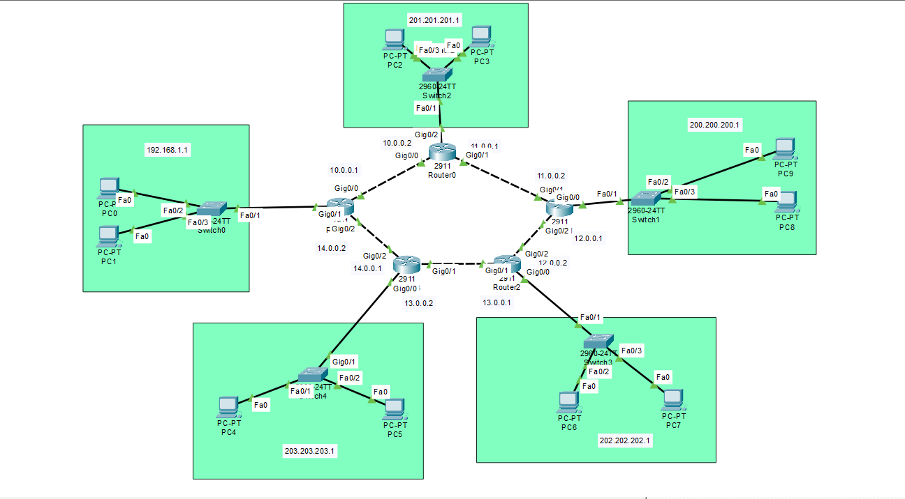

# 🚀 Enterprise Routing Lab – RIP, OSPF & EIGRP (Cisco Packet Tracer)


---

## 📌 Project Overview

This project simulates a **real-world enterprise network** using multiple dynamic routing protocols:

- 🔁 RIP v2 (Baseline routing)
- ⚡ EIGRP (Fast convergence - Cisco proprietary)
- 🌐 OSPF (Enterprise-grade link-state routing)

The network is designed using a **ring topology** to ensure:

- Redundancy  
- Failover support  
- Multiple routing paths  

---

## 🧠 Architecture Overview
         [LAN 2]
           |
           B
         /   \
        A     C —— [LAN 3]
       /       \
 [LAN1]         D —— [LAN 4]
       \       /
        E ————
           |
       [LAN 5]


> 💡 **Design Concept:**
> - Core routers form a **ring (high availability)**
> - Each router connects to a **separate LAN**
> - Routing protocols dynamically discover all networks

---

## 🖼️ Network Topologies

### 🔹 RIP & EIGRP Scenario


### 🔹 OSPF Full Enterprise Scenario


---

## 🌐 Network Design

### 🟢 LAN Networks

| LAN | Network | Description |
|-----|--------|------------|
| LAN 1 | 192.168.1.0/24 | Internal users |
| LAN 2 | 201.201.201.0/24 | Branch network |
| LAN 3 | 200.200.200.0/24 | External segment |
| LAN 4 | 202.202.202.0/24 | Remote office |
| LAN 5 | 203.203.203.0/24 | Backup site |

---

### 🔗 Router Backbone Networks

| Connection | Network |
|------------|--------|
| A ↔ B | 10.0.0.0 |
| B ↔ C | 11.0.0.0 |
| C ↔ D | 12.0.0.0 |
| D ↔ E | 13.0.0.0 |
| E ↔ A | 14.0.0.0 |

---

## ⚙️ Routing Protocols Implementation

### 🔸 RIP v2 (Baseline)

- Distance Vector Protocol  
- Hop count metric  
- Simple but limited scalability 

```bash
router rip
version 2
network 192.168.1.0
network 10.0.0.0
network 14.0.0.0
no auto-summary
```

### 🔸 EIGRP (Advanced Performance)

Fast convergence

Uses composite metric (Bandwidth + Delay)

Supports unequal load balancing


```bash
router eigrp 100
network 192.168.1.0
network 10.0.0.0
network 14.0.0.0
no auto-summary
```

### 🔸 OSPF (Enterprise Standard)

Link-State Protocol

Uses SPF (Dijkstra Algorithm)

Scalable and efficient

```bash
router ospf 1
network 192.168.1.0 0.0.0.255 area 0
network 10.0.0.0 0.0.0.255 area 0
network 14.0.0.0 0.0.0.255 area 0
```


